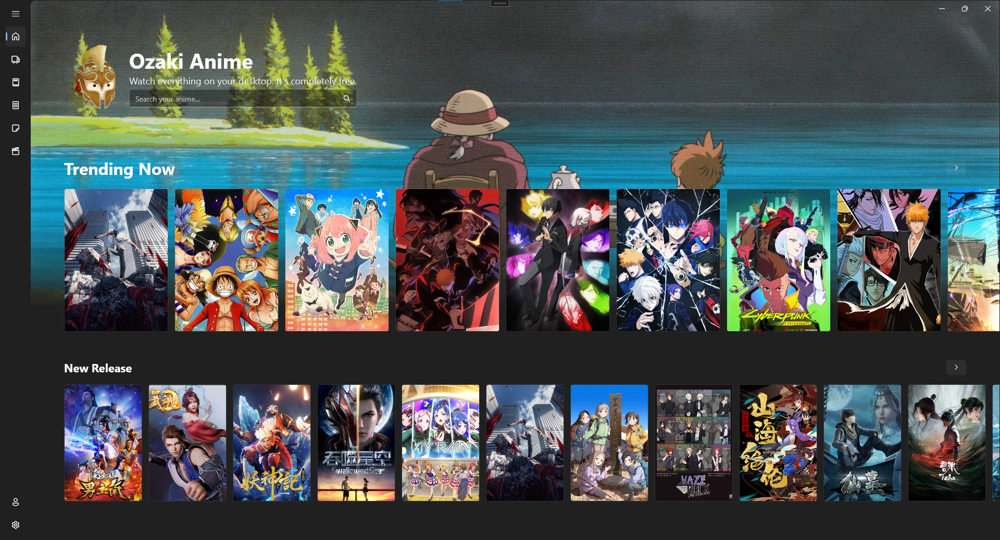
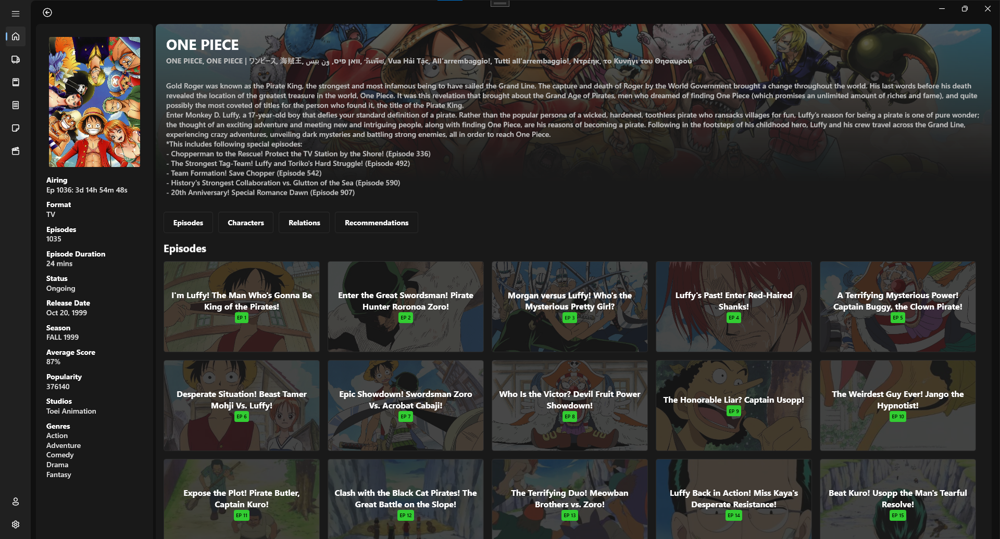
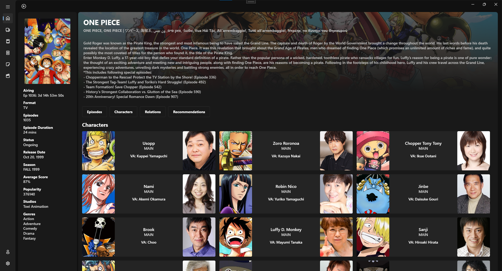
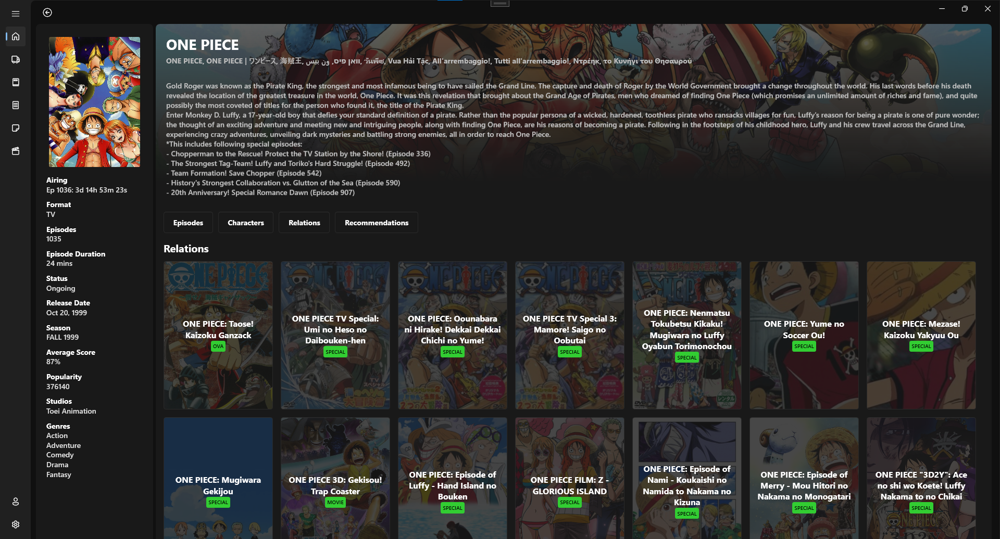
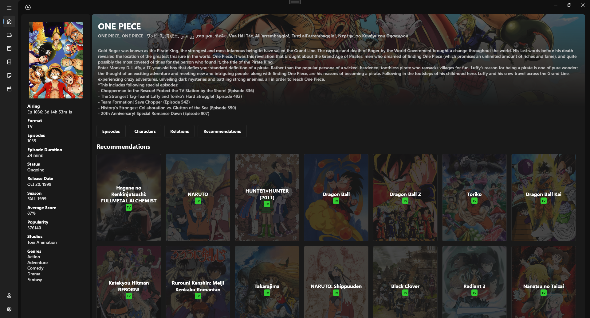
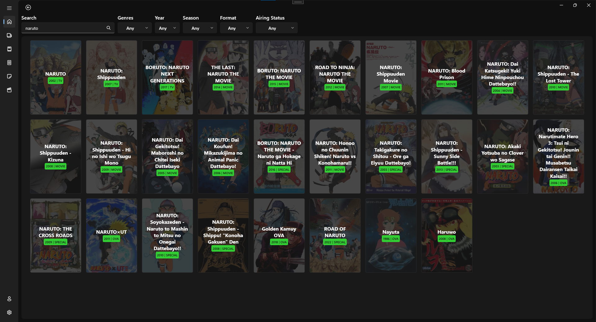
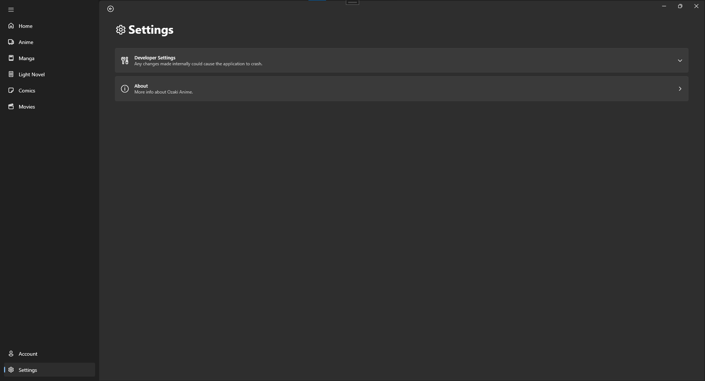

<h1 align="center">
Ozaki Anime
</h1>

 Watch anime on your desktop without any ads. An All-In-One app. It is totally free. Although it was intended primarily for anime, I decided to include more in the future. Simply said, I no longer want websites to open new tabs and direct me to sexual and e-commerce websites. You've been there, I believe. Adblock extensions blocker is nowadways installed. In order to watch and read, I must turn off my adblocker. This project is personal. At your own risk, use it. You're lucky if you found this app.

## Requirements

- Windows 10 or later. (Latest Patch or Update)
- .NET 6 (https://dotnet.microsoft.com/en-us/download/dotnet/6.0)
-	Internet
- [OPTIONAL] Host your own API and paste it in the developer settings, if you prefer faster load time (https://github.com/consumet/api.consumet.org).

## Community
**This app will receive updates for new features (unless I have time).** 

Please start a GitHub Issue if you have a problem.

If you'd want to contribute to this project, please leave a star 🌟 and share it with your friends! 😎

I would appreciate it if you could offer me a cup of coffee. ☕💖

## User Interface v0.5

Anime Home
 

Anime Info and Episodes
 

Anime Characters and Voice Actors
 

Relations
 

Recommendations
 

Play Episode
 

Search
 

Settings
 

### Features
- Advanced Search for Anime (Genres, Year, Season, Format, Airing Status)
- Play, Prev Episode, Fullscreen(ESC to exit fullscreen), Next Episode, Picture-Picture Control.
- Quality Selection (1080p, 720p, 480p, 360p, 240p, 144p)
- Show Episode Countdown
- Account (Favorites)
- Display Trending and Recent releases
- Display Episodes, Characters, Voice Actors, Relations, and Recommendations

### TODO
- Changeable API Route (gogoanime, zoro, anime)
- Manga
- Comics
- Movies
- Light Novel

### Downloads
Looking for the download link? go here [Releases](https://github.com/Ozakinn/OzakiAnimeWPF/releases) and download setup.exe

### Credits
[Consumet API](https://github.com/consumet/api.consumet.org) - provides the information required for the application to function effectively. Don't forget to 🌟 the repo.

## License

Distributed under the GNU General Public License v3.0 License. See [LICENSE](/LICENSE) for more information.

(<a href="#top">back to top</a>)

